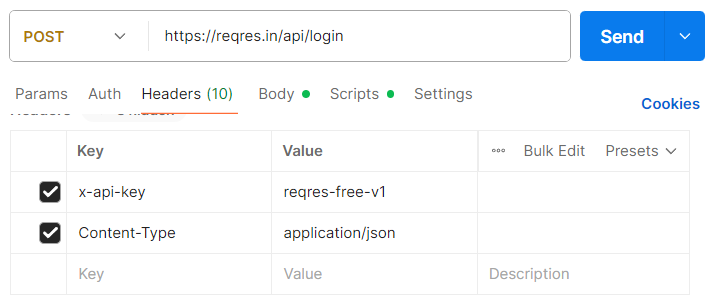
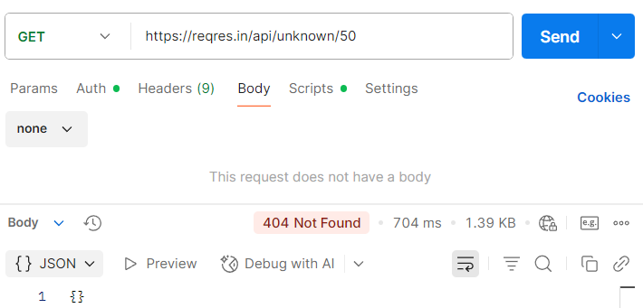

# *توثيـق واجهـات برمجـة التطبيقات (API)*  

### ***مثال توضيحي لعمليات CRUD باستخدام واجهة Reqres.in***  

  

<strong>إعداد: أحمد موسى</strong>
  

<strong>التاريخ: 2025/09/25</strong>
  

---

<h1>المحتويات</h1>
<ol dir="rtl">
  <li><a href="#المقدمة">المقدمة</a></li>
  <li>
    <a href="#المتطلبات-الأساسية">المتطلبات الأساسية</a>
    <ul dir="rtl" style="list-style-type:none; padding-right:20px;">
      <li><a href="#21-الشرط-الأول">2.1 الشرط الأول</a></li>
      <li><a href="#22-الشرط-الثاني">2.2 الشرط الثاني</a></li>
    </ul>
  </li>
  <li>
    <a href="#نظرة-عامة-وطبيعة-الواجهة-reqresin">نظرة عامة وطبيعة الواجهة (Reqres.in)</a>
    <ul dir="rtl" style="list-style-type:none; padding-right:20px;">
      <li><a href="#31-طبيعة-الواجهة-التجريبية">3.1 طبيعة الواجهة التجريبية</a></li>
      <li><a href="#32-أفضل-ممارسات-الاختبار">3.2 أفضل ممارسات الاختبار</a></li>
    </ul>
  </li>
  <li>
    <a href="#المصادقة-authentication--login">المصادقة (Authentication / Login)</a>
    <ul dir="rtl" style="list-style-type:none; padding-right:20px;">
      <li><a href="#41-الهدف-من-المصادقة">4.1 الهدف من المصادقة</a></li>
      <li><a href="#42-إرسال-طلب-تسجيل-الدخول">4.2 إرسال طلب تسجيل الدخول</a></li>
      <li><a href="#43-الاستجابة-المتوقعة">4.3 الاستجابة المتوقعة</a></li>
      <li><a href="#44-استخدام-الـ-token">4.4 استخدام الـ Token</a></li>
      <li><a href="#45-ملاحظات-مهمة">4.5 ملاحظات مهمة</a></li>
    </ul>
  </li>
  <li>
    <a href="#العمليات-الأساسية-crud-باستخدام-postman">العمليات الأساسية (CRUD) باستخدام Postman</a>
    <ul dir="rtl" style="list-style-type:none; padding-right:20px;">
      <li><a href="#51-get--جلب-البيانات">5.1 GET – جلب البيانات</a></li>
      <li><a href="#52-post--إنشاء-بيانات-جديدة">5.2 POST – إنشاء بيانات جديدة</a></li>
      <li><a href="#53-put--تعديل-كامل-للبيانات">5.3 PUT – تعديل كامل للبيانات</a></li>
      <li><a href="#54-patch--تعديل-جزئي-للبيانات">5.4 PATCH – تعديل جزئي للبيانات</a></li>
      <li><a href="#55-delete--حذف-البيانات">5.5 DELETE – حذف البيانات</a></li>
    </ul>
  </li>
  <li>
    <a href="#العمليات-الأساسية-على-resources">العمليات الأساسية على Resources</a>
    <ul dir="rtl" style="list-style-type:none; padding-right:20px;">
      <li><a href="#61-get--جلب-قائمة-الموارد">6.1 GET – جلب قائمة الموارد</a></li>
      <li><a href="#62-get--جلب-مورد-واحد">6.2 GET – جلب مورد واحد</a></li>
    </ul>
  </li>
  <li>
    <a href="#أمثلة-باستخدام-أمر-curl">أمثلة باستخدام أمر curl</a>
    <ul dir="rtl" style="list-style-type:none; padding-right:20px;">
      <li><a href="#71-المصادقة-authentication--login">7.1 المصادقة (Authentication / Login)</a></li>
      <li><a href="#72-get--جلب-مستخدم">7.2 GET – جلب مستخدم</a></li>
      <li><a href="#73-post--إنشاء-مستخدم">7.3 POST – إنشاء مستخدم</a></li>
      <li><a href="#74-put--تعديل-كامل">7.4 PUT – تعديل كامل</a></li>
      <li><a href="#75-patch--تعديل-جزئي">7.5 PATCH – تعديل جزئي</a></li>
      <li><a href="#76-delete--حذف">7.6 DELETE – حذف</a></li>
    </ul>
  </li>
  <li>
    <a href="#معالجة-الأخطاء-error-handling">معالجة الأخطاء (Error Handling)</a>
    <ul dir="rtl" style="list-style-type:none; padding-right:20px;">
      <li><a href="#81-مبادئ-عامة">8.1 مبادئ عامة</a></li>
      <li><a href="#82-رموز-الحالة-الشائعة">8.2 رموز الحالة الشائعة</a></li>
      <li><a href="#83-مسار-تشخيص-سريع-troubleshooting">8.3 مسار تشخيص سريع (Troubleshooting)</a></li>
      <li><a href="#84-أفضل-ممارسات-التعامل-مع-الأخطاء-في-العميل">8.4 أفضل ممارسات التعامل مع الأخطاء في العميل</a></li>
    </ul>
  </li>
  <li><a href="#التصفّح-pagination">التصفّح (Pagination)</a></li>
  <li>
    <a href="#الملاحق">الملاحق</a>
    <ul dir="rtl" style="list-style-type:none; padding-right:20px;">
      <li><a href="#101-مصطلحات-موحّدة">10.1 مصطلحات موحّدة</a></li>
      <li><a href="#102-روابط-مفيدة">10.2 روابط مفيدة</a></li>
    </ul>
  </li>
</ol>

## 1. المقدمة

يُقدّم هذا الدليل شرحًا عمليًا لاستخدام واجهة برمجة التطبيقات التجريبية Reqres.in.  

يٌركّز الدليل على توضيح كيفية تنفيذ العمليات الأساسية (CRUD) وآلية المصادقة (Authentication) بالإضافة إلى معالجة الأخطاء (Error Handling) وتنظيم النتائج عبر التصفّح (Pagination).  

الهدف من هذا الدليل هو تزويد المطوّر بخطوات واضحة وأمثلة عملية يمكن الاعتماد عليها لاختبار واجهات برمجة التطبيقات وفهم كيفية عملها.  

**الفئات المستهدفة:**  

- المطوّرون المبتدئون الراغبون في تعلّم مبادئ REST APIs، وكذلك المطوّرون المتقدمون الذين يحتاجون إلى مرجع سريع أو أمثلة عملية.  
- فرق العمل التي تحتاج إلى مرجع تدريبي لتجربة وبناء طلبات واجهة برمجة التطبيقات.  

---

## 2. المتطلبات الأساسية

قبل البدء في استخدام واجهة Reqres.in، ينبغي التأكد من توافر مجموعة من المتطلبات التي تُمكّن المطوّر من تنفيذ الطلبات (Requests) ومعالجة الاستجابات (Responses) بكفاءة:  

- اتصال إنترنت مستقر لضمان تنفيذ جميع العمليات دون انقطاع.  
- أداة لاختبار واجهات برمجة التطبيقات (API Testing Tool) مثل Postman أو أي بديل مكافئ يتيح إنشاء الطلبات، إضافة الرؤوس (Headers)، إرسال البيانات عبر الجسم (Body)، واستعراض الاستجابات.  

> يمكن تحميل البرنامج من هنا: [Postman](https://www.postman.com/downloads/)  

- يمكن الاستعانة بأداة سطر أوامر (Command Line Tool) مثل cURL لاختبار الطلبات من خلال الطرفية (Terminal)، بينما يكفي للمبتدئين الاعتماد على أداة رسومية مثل Postman في المراحل الأولى.  
- يُفضل الإلمام بأساسيات REST APIs، بما في ذلك طرق HTTP Methods (GET، POST، PUT، PATCH، DELETE) والبنية العامة للطلبات والاستجابات.  
- معرفة برموز حالة (HTTP Status Codes) مثل:  
  - 200 (تم التنفيذ بنجاح)  
  - 201 (تم إنشاء مورد جديد)  
  - 400 (طلب غير صالح)  
  - 401 (غير مصرح)  
  - 404 (المورد غير موجود)  
- إلمام بكيفية التعامل مع JSON (JavaScript Object Notation)، باعتبارها الصيغة الأساسية لتبادل البيانات بين العميل والخادم.  

---

## 3. نظرة عامة وطبيعة الواجهة (Reqres.in)

Reqres.in هي واجهة برمجة تطبيقات تجريبية (Mock API) تتيح للمطوّرين اختبار مفاهيم REST APIs في بيئة آمنة ومجانية. صُمِّمت هذه الواجهة لمحاكاة سلوك أنظمة حقيقية دون الحاجة إلى إعداد خوادم أو قواعد بيانات.

---

**المزايا الرئيسية:**

- مجانية بالكامل ولا تتطلّب إنشاء حساب.

- تدعم العمليات الأساسية (CRUD)
  عبر طرق HTTP Methods.

- تُوفّر بيانات جاهزة للتعامل مع كيانات مثل Users
  و Resources.

- تدعم التصفّح (Pagination) وإرجاع
  رموز الحالة القياسية (HTTP Status
  Codes).

- سهلة الاستخدام عبر أدوات رسومية مثل Postman
  أو عبر الطرفية باستخدام
  cURL.

**الموقع الرسمي**: <https://reqres.in>

**3.1
طبيعة الواجهة التجريبية**

- Reqres.in ليست قاعدة بيانات فعلية؛ الغرض منها التدريب
  والعرض فقط.

- بعد تنفيذ POST وإنشاء
  معرّف (id)، قد لا تتمكّن من جلب نفس العنصر لاحقًا
  عبر GET قد تعود الاستجابة (404 Not
  Found).

- هذا السلوك متعمّد للتجارب وليس خللًا.

**حدود الاستخدام (Rate Limits)**

- قد تُحاكي الواجهة قيودًا على المعدّل (429Too Many
  Requests ).

- عند ظهور 429، يُنصح بالانتظار فترة قصيرة ثم إعادة
  المحاولة.

**3.2 أفضل
ممارسات الاختبار**

- استخدم معرّفات ثابتة في أمثلة القراءة مثل: GET
  /api/users/2)).

- افصل بين اختبارات القراءة (GET)
  والكتابة (POST/PUT/PATCH/DELETE)
  لتتبّع النتائج بسهولة.

- احتفظ بقوالب جاهزة للطلبات (Postman Collection)
  لتسريع الاختبارات المتكررة.

4.  **المصادقة
    (Authentication / Login)**

**4****.1
الهدف من المصادقة**  
التحقّق من هوية المستخدم والحصول على رمز أمني
(Token) لاستخدامه في تفويض الطلبات اللاحقة.

**4.2 إرسال
طلب تسجيل الدخول**

- الطريقة (Method): POST

- المسار /api/login :(Endpoint)
  

- الرؤوس Content-Type: application/json
  :(Headers)

- الجسم
  (Body):JSON

{

"email": "eve.holt@reqres.in",

"password": "Ahmed1-Viper@1stPass"

}

**4.3
الاستجابة المتوقعة**

- **عند النجاح :(OK) 200
  **

- **في حال الفشل:**

  - (بيانات ناقصة أو غير صحيحة) 400 Bad Request

  - (غير مصرح) 401 Unauthorized

**4.4
استخدام الـ Token في الطلبات
اللاحقة**

- الطريقة العامة (إضافة يدويا فى الـ
  Headers)

  - Authorization: Bearer \<token\>

- الطريقة البديلة فى Postman
  (اختر طريقة واحدة اى تضع القيمه فى Headers
  أو من Auth Type)

  - عبر تبويب Headers:

> Authorization: Bearer \<token\> 

- أو عبر تبويب Auth:

> Type: Bearer Token 
>
> ثم إدخال قيمة الـ Token
> المستلمة.

**4.5
ملاحظات مهمة**

- بما أنّ Reqres.in واجهة تجريبية،
  بعض الطلبات قد تعمل دون الحاجة إلى
  Token.

- يبقى الـ Token صالحًا ما لم
  يتغيّر.

- لا حاجة لإرسال Body مع
  طلبات Get.

- **الطلبات تتطلّب إضافة API Key
  في الهيدر:  
  x-api-key: reqres-free-v1**

5.  **العمليات الأساسية
    (CRUD)باستخدام برنامج Postman**

يوضّح هذا القسم كيفية تنفيذ العمليات الأساسية على الموارد
(المستخدمين والمصادر) باستخدام واجهة Reqres.in.  
كل عملية مرفقة بخطوات التنفيذ، مقتطف JSON
مبسّط، وصورة Postman توضّح الطلب
والاستجابة.

**5.1GET
– جلب البيانات**

**الهدف:** استدعاء بيانات من الخادم: إمّا قائمة
المستخدمين أو مستخدم واحد.

**5.1.2 جلب قائمة المستخدمين**

- Method: GET

- Endpoint: /api/users?page=2

- Headers: Content-Type: application/json

- غير مطلوبBody:

**استجابة متوقعة :(OK)
200**

**5.1.3 جلب مستخدم واحد**

- Method: GET

- Endpoint: /api/users/2

- Headers: Content-Type: application/json

**استجابة متوقعة :(OK)
200**

- في حال لم يُعثر على المستخدم 404 Not
  Found.

**5.2
POST –
إنشاء بيانات جديدة**

الهدف: إرسال بيانات جديدة إلى الخادم لإنشاء
مستخدم.

- Method: POST

- Endpoint: /api/users

- Headers: Content-Type: application/json

{

"name": "Ahmed Mousa",

"job": "Tech Writer"

}

**استجابة متوقعة :(Created)
201**

**5.3
 – PUTتعديل كامل
للبيانات**

الهدف: تحديث بيانات مستخدم بشكل كامل (استبدال القيم
القديمة بقيم جديدة).

- Method: PUT

- Endpoint: /api/users/2

{

"name": "Ahmed Hamdy",

"job": "Tech Writer Lead"

}

**استجابة متوقعة :(OK)
200**

**5.4
– PATCH تعديل جزئي
للبيانات**

الهدف: تحديث جزء محدد من بيانات المستخدم.

- Method: PATCH

- Endpoint: /api/users/2

{

"job": "Principal Technical Writer"

}

**استجابة متوقعة :(OK)
200**

**5.5
DELETE –
حذف البيانات**

الهدف: حذف مستخدم بشكل نهائي.

- Method: DELETE

- Endpoint: /api/users/2

- غير مطلوبHeaders / Body:

**استجابة متوقعة No Content
204**

**6.
العمليات الأساسية على (Resources)**

**6.1 
GETجلب قائمة الموارد**

الهدف: جلب قائمة Resources مع دعم
التصفّح (Pagination).

تفاصيل الطلب

- Method: GET

- Endpoint: /api/unknown?page=1

- غير مطلوبين Headers & Body:

**استجابة متوقعة :(OK)
200**

**ملاحظات مهمة**

- مفاتيح التصفّح: page, per_page, total,
  total_pages

- يمكن تغيير الصفحة باستخدام معاملات الاستعلام
  (Query Parameters) مثل ?page=2

**6.2 GET
– جلب مورد واحد**

الهدف: جلب Resource واحد باستخدام
المعرّف (ID).

تفاصيل الطلب

- Method: GET

- Endpoint: /api/unknown/2

- غير مطلوبين Headers & Body:

**استجابة متوقعة :(OK)
200**

**في حال عدم العثور**

- **404 Not Found** عند استخدام معرّف غير موجود.

**7.
أمثلة باستخدام أمر curl**

يمكن نسخ الأمر ثم لصقة فى سطر الأوامر
CMD.

**7.1
المصادقة (Authentication / Login)**

**cURL:**

curl -X POST "https://reqres.in/api/login" -H "Content-Type:
application/json" -H "x-api-key: reqres-free-v1" -d
"{\\email\\:\\eve.holt@reqres.in\\,\\password\\:\\AhmedTheBest\\}"

**استجابة
متوقعة 200 :(OK)**

**7.2GET
– جلب مستخدم**

> **cURL:**
>
>  alt="C:\Users\engra\AppData\Local\Microsoft\Windows\INetCache\Content.Word\Screenshot 2025-09-25 210044.png" />curl
> "https://reqres.in/api/users/2" -H "x-api-key: reqres-free-v1"

**جلب المستخدمين**

**cURL:**

curl "https://reqres.in/api/users?page=2" -H "x-api-key: reqres-free-v1"

**7.3POST
– إنشاء مستخدم**

**cURL:**

curl -X POST "https://reqres.in/api/users" -H "Content-Type:
application/json" -H "x-api-key: reqres-free-v1" -d
"{\\name\\:\\Ahmed\\,\\job\\:\\Developer\\}"

**7.4PUT
– تعديل كامل**

**cURL:**

curl -X PUT "https://reqres.in/api/users/2" -H "Content-Type:
application/json" -H "x-api-key: reqres-free-v1" -d
"{\\name\\:\\Ahmed\\,\\job\\:\\Senior Dev\\}"

**7.5PATCH
– تعديل جزئي**

**cURL:**

curl -X PATCH "https://reqres.in/api/users/2" -H "Content-Type:
application/json" -H "x-api-key: reqres-free-v1" -d "{\\job\\:\\Tech
Lead\\}"

**7.6DELETE
– حذف**

**cURL:**

curl -X DELETE "https://reqres.in/api/users/2" -H "x-api-key:
reqres-free-v1"

**استجابة متوقعة:204 No Content**

**التفكيك والشرح:**

1.  **curl**

    - هذا البرنامج هو أداة لعمل طلبات HTTP (GET /
      POST / PUT / PATCH / DELETE) 

2.  **-X POST**

    - -X معناها: نوع الطريقة اللي هتستخدمه (HTTP
      Method) 

    - هنا اخترنا POST

    - يمكن أن يكون:

      - GET جلب بيانات

      - POST إرسال بيانات جديدة

      - PUT تحديث كامل

      - PATCH تحديث جزئي

      - DELETE حذف

3.  **"https://reqres.in/api/login"**

    - ده الـمسار
      (Endpoint) اللي
      هيتبعتله الطلب.

    - في المثال /api/login
      

4.  **-H "Content-Type: application/json"**

    - -H معناها Header 

    - الـ Header بيتكتب كـ
      Name: Value

    - هنا معناه إن جسم الطلب (Body)
      مكتوب بصيغة JSON

    - مكان Value ممكن تحط أي قيمة
      لازمة زي application/xml لو XML

5.  **-H "x-api-key: reqres-free-v1"**

    - مثال على هيدر تاني.

    - هنا اسمه x-api-key،
      وقيمته reqres-free-v1

    - أنت تغيّر الجزء ده لو عندك API Key
      مختلف.

6.  **-d
    "{\\email\\:\\your_email@example.com\\,\\password\\:\\your_password\\}"**

    - -d معناها: بيانات الجسم
      اللي هيتبعت في الطلب.

    - لازم يكون مكتوب بصيغة JSON
      لو الـ API بيطلب
      كده.

    - في المثال:

      - email: هنا تكتب إيميلك.

      - password: هنا تكتب الباسورد.

    - لو الطلب ما يحتاجش Body
      مثل GET لا تكتب -d

**الخلاصة العملية:**

- **-X** هو نوع العملية .(GET/POST/PUT/DELETE)
  

- **-H** هو بيانات Header دايما
  اسم:قيمةName: Value مثل Content-Type
  أو .Authorization 

- **-d** هو بيانات Body تبعتها في
  شكل .JSON

**8. معالجة
الأخطاء (Error Handling)**

**8.1 مبادئ
عامة**

- تُرجِع الواجهة رموز حالة (HTTP Status Codes)
  قياسية توضّح نتيجة الطلب.

- تُعرَض تفاصيل الخطأ –عند توفّرها– في الاستجابة
  (Response) بصيغة JSON ليسهل
  قراءتها ومعالجتها برمجيًا.

- يجب دائمًا قراءة الرمز والنص المصاحب له لتحديد الإجراء
  المناسب (تصحيح الطلب، إعادة المحاولة، المصادقة… إلخ).

**8.2 رموز الحالة
الشائعة**

- 200 OK : نجاح الطلب (GET / PUT / PATCH)

- 201 Created: تم إنشاء مورد جديد (POST)
  

- 204 No Content: نجاح بدون جسم استجابة (DELETE)

- 400 Bad Request : جسم أو صيغة طلب غير صحيحة.

- 401 Unauthorized : نقص المصادقة أو Token
  غير صالح.

- 404 Not Found : المورد غير موجود مثل (GET
  /api/users/23) 

- 429 Too Many Requests : تجاوز حدّ المعدّل (Rate
  Limit) – إن وُجد.

- 500 Internal Server Error: خطأ عام في الخادم.

**8.3 مسار تشخيص
سريع (Troubleshooting)**

- تحقّق من Method وEndpoint
  ومن الأخطاء الشائعة: كتابة GET
  في شريط العنوان بدل اختياره من القائمة.

- راجع Headers المطلوبة
  (مثل Content-Type: application/json و
  Authorization: Bearer \<token\> عند الحاجة)

- تأكّد من أن Body مكتوب
  بصيغة JSON صحيحة، و وجود الحقول الإلزامية (مثل
  البريد الإلكتروني/كلمة المرور في تسجيل الدخول(

- جرّب بمعرّفات صحيحة: بعض المعرّفات في Reqres.in
  ثابتة (مثل المستخدم 2)، بينما المعرّفات المُنشأة تجريبيًا
  قد لا تبقى محفوظة.

- راقب أولًا Status Code ثم نصّ
  الخطأ لتحديد الإجراء المناسب (إعادة الإرسال، تعديل المدخلات،
  إضافة (Token

**8.4
أفضل ممارسات التعامل مع الأخطاء في العميل
(Client)**

- أظهر رسالة واضحة للمستخدم النهائي مشتقّة من
  Status Code.

- لا تفترض نجاح الطلب؛ افحص الرمز دائمًا قبل استخدام
  البيانات.

- أعد المحاولة تلقائيًا فقط في الحالات المناسبة (مثل
  مشاكل الشبكة، وليس عند 400 Bad Request)

- سجّل تفاصيل الخطأ (Logging)
  لأغراض التشخيص والمتابعة.

**9.
التصفّح (Pagination)**

الهدف**:** تنظيم النتائج على صفحات متتالية لتقليل حجم
الاستجابة وتسهيل العرض والتنقّل.

طريقة الاستخدام (قائمة المستخدمين مثالًا)

- (Method): GET

- (Endpoint): /api/users?page=2

- (Query Parameters):

  - page لتحديد الصفحة المطلوبة.

**الاستجابة المتوقّعة 200 :(OK)**

{

"page": 2,

"per_page": 6,

"total": 12,

"total_pages": 2,

"data": \[ /\* عناصر الصفحة \*/ \]

}

**ملاحظات مهمة**

- يمكن الانتقال بين الصفحات بتغيير قيمةpage
  مثل ?page=1, ?page=2

- عدد العناصر في الصفحة (per_page)
  ثابت فيReqres.in لأغراض العرض،
  لكنه قد يختلف في واجهات حقيقية.

- في نهاية الصفحات، قد تعود الاستجابة بحقلdata
  فارغ دون أن يكون ذلك خطأ.

**10.
الملاحق**

**10.1 مصطلحات
موحّدة**

- :Token رمز أمني يُستخدم لتفويض الطلبات.

- HTTP Methods: GET, POST, PUT, PATCH, DELETE.

- HTTP Status Codes: 200, 201, 204, 400, 401, 404, 429, 500.

- Requests / Responses طلبات / استجابات.

- JSON (JavaScript Object Notation) صيغة لتبادل البيانات
  بين العميل والخادم.

**10.2 روابط
مفيدة**

- **الموقع الرسمي: <https://reqres.in>**

- **تحميل:Postman 
  <https://www.postman.com/downloads/>**

- **شرح فلسفة RESTful API
  بالعربية من حسوب: [Hsoub in
  Arabic](https://academy.hsoub.com/programming/general/شرح-فلسفة-restful-تعلم-كيف-تبني-واجهات-rest-البرمجية-r635/)**

- **تعلم اساسيات :RESTful API
  [https://restfulapi.net/](https://restfulapi.net/)**

